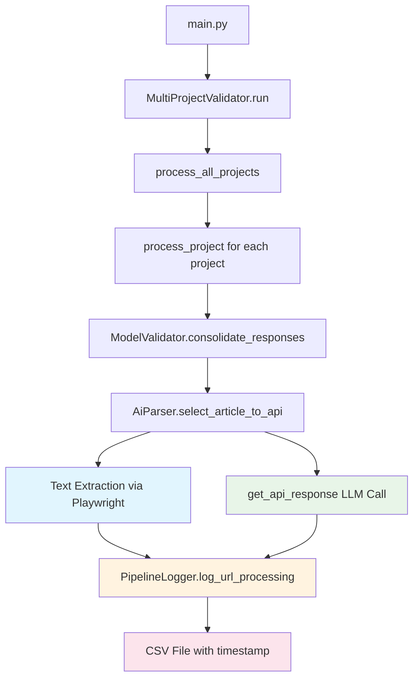

# Enhanced Pipeline Logging Implementation Plan

## 📋 Project Overview

This plan implements URL logging functionality for the AI parser pipeline to track success/failure through text extraction and LLM processing stages. The implementation follows a **happy path first** approach with **feature-level chunks**.

## 🏗️ Architecture Flow



## 📊 CSV Schema

**File Location**: `pipeline_logs/pipeline_log_2025-01-10_17-55-01.csv`

| Column | Type | Description | Example Values |
|--------|------|-------------|----------------|
| `URL` | string | The URL being processed | `https://example.com/article` |
| `project_name` | string | Project identifier | `SolarProject_CA` |
| `timestamp` | string | ISO 8601 with timezone | `2025-01-10T17:55:01-07:00` |
| `text_extraction_status` | string | Success/failure flag | `"True"` or `"False"` |
| `text_extraction_error` | string | Error details or None | `"None"` or `"TimeoutError: Page load timeout"` |
| `text_length` | integer | Characters extracted | `1542` or `0` |
| `llm_response_status` | string | Success/failure flag | `"True"` or `"False"` |
| `llm_response_error` | string | Error details or None | `"None"` or `"API rate limit exceeded"` |
| `response_time_ms` | integer | Total processing time | `2340` |

---

# Implementation Steps

## Step 1: Create Pipeline Logging Infrastructure

### Objective
Create the core `PipelineLogger` class with CSV writing capabilities and thread-safe operations.

### Code Generation Prompt

```
You are implementing a pipeline logging system for a web scraping and AI processing pipeline. Create a new file called `pipeline_logger.py` that implements a PipelineLogger class.

Requirements:
1. Create a PipelineLogger class that handles CSV logging for URL processing
2. Initialize with a log directory path and automatically create timestamped CSV files
3. Provide a log_url_processing method that accepts: url, project_name, timestamp, text_extraction_status, text_extraction_error, text_length, llm_response_status, llm_response_error, response_time_ms
4. Handle CSV file creation with proper headers
5. Implement thread-safe file writing using threading.Lock()
6. Use proper timestamp formatting (ISO 8601 with timezone)
7. File naming convention: pipeline_log_YYYY-MM-DD_HH-MM-SS.csv

CSV Schema:
- URL (string)
- project_name (string) 
- timestamp (string, ISO 8601 with timezone)
- text_extraction_status (string, "True" or "False")
- text_extraction_error (string, error message or "None")
- text_length (integer, character count)
- llm_response_status (string, "True" or "False") 
- llm_response_error (string, error message or "None")
- response_time_ms (integer, milliseconds)

Implementation details:
- Use csv.writer for CSV operations
- Create directory if it doesn't exist using pathlib
- Write headers only once when file is created
- Use threading.Lock for thread safety
- Format timestamps using datetime.now().astimezone().isoformat()
- Handle the happy path - assume all inputs are valid

Create a simple test at the bottom that demonstrates:
- Creating a logger instance
- Logging a successful URL processing event
- Verifying the CSV file is created with correct content

Focus on clean, readable code with proper error handling for file operations.
```

## Step 2: Directory Setup and Integration Points

### Objective
Modify main.py and validation classes to create pipeline_logs directory and pass logger through the chain.

### Code Generation Prompt

```
You are modifying an existing AI pipeline codebase to add logging integration points. You need to modify three files to pass a PipelineLogger instance through the processing chain.

Files to modify:
1. main.py - Add pipeline_logs directory creation and logger initialization
2. multi_project_validator.py - Accept and pass logger parameter
3. page_tracker.py - Accept logger in ModelValidator and AiParser classes

Changes needed:

**main.py modifications:**
- Import the PipelineLogger class from pipeline_logger
- Around line 88 (after other directory creation), add: await create_directory(Path(__file__).resolve().parent / 'pipeline_logs')
- After line 98 (MultiProjectValidator initialization), add logger creation and pass to constructor:
  ```python
  pipeline_logs_dir = Path(__file__).resolve().parent / 'pipeline_logs'
  logger = PipelineLogger(pipeline_logs_dir)
  ```
- Add logger=logger parameter to MultiProjectValidator constructor

**multi_project_validator.py modifications:**
- Add logger parameter to __init__ method (optional, default None)
- Store as self.logger = logger
- In process_project method around line 112-116, pass logger to ModelValidator constructor

**page_tracker.py modifications:**
- Add logger parameter to ModelValidator.__init__ (optional, default None)
- Store as self.logger = logger  
- Add logger parameter to AiParser.__init__ (optional, default None)
- Store as self.logger = logger
- In ModelValidator.get_responses_for_url method around line 226-230, pass logger to AiParser constructor

Requirements:
- All logger parameters should be optional to maintain backward compatibility
- Store logger instances as class attributes
- Ensure logger is passed through the entire chain: main -> MultiProjectValidator -> ModelValidator -> AiParser
- Don't add any logging calls yet - just set up the infrastructure
- Maintain all existing functionality

Focus on clean integration that doesn't break existing code. The actual logging calls will be added in the next step.
```

## Step 3: Text Extraction Logging Integration

### Objective
Integrate logging into the text extraction phase (Playwright operations) in AiParser.select_article_to_api.

### Code Generation Prompt

```
You are adding logging integration to the text extraction phase of an AI pipeline. Modify the AiParser.select_article_to_api method in page_tracker.py to capture timing and status information for text extraction.

Current method location: page_tracker.py, lines 98-131

Requirements:
1. Add timing measurements around Playwright operations (page.goto, page.title, page.evaluate)
2. Track text extraction success/failure status  
3. Capture text length from extracted content
4. Store any extraction errors that occur
5. Prepare logging data for later use (don't write to CSV yet)

Implementation approach:
- Use time.perf_counter() for accurate timing measurements
- Create a logging_context dictionary to store all metrics
- Wrap Playwright operations in try/except to capture success/failure
- Calculate text length from the combined title + text content
- Store the logging context as an instance variable for later use

Specific changes to select_article_to_api method:
1. Add timing start before Playwright operations
2. Wrap the existing try/except block to capture text extraction status
3. Calculate text length from fulltext variable
4. Store logging context with: text_extraction_start_time, text_extraction_status, text_extraction_error, text_length
5. Don't modify the existing return value or method signature

Logging context structure:
```python
self.current_logging_context = {
    'url': url,
    'project_name': self.project_name,
    'text_extraction_start_time': start_time,
    'text_extraction_status': True/False,
    'text_extraction_error': error_message or None,
    'text_length': len(fulltext) if successful else 0
}
```

Key requirements:
- Maintain all existing functionality
- Don't change method return values
- Capture accurate timing around only the Playwright operations
- Store context for use in get_api_response method
- Handle the happy path - successful text extraction

The logging context will be used in the next step to complete the logging cycle after LLM processing.
```

## Step 4: LLM Processing Logging and Complete Cycle

### Objective
Add LLM processing metrics and complete the logging cycle by writing to CSV.

### Code Generation Prompt

```
You are completing the pipeline logging integration by adding LLM processing metrics and finalizing the CSV logging cycle. Modify two methods in the AiParser class in page_tracker.py.

Methods to modify:
1. get_api_response method (lines 65-83) - Add LLM timing and status tracking
2. select_article_to_api method - Complete the logging cycle with CSV write

**get_api_response method changes:**
1. Add timing measurements around the OpenAI API call (self.client.chat.completions.create)
2. Track LLM response success/failure status
3. Capture any API errors that occur
4. Return timing and status information along with the response

Modify get_api_response to return a tuple: (response_content, llm_metrics)
Where llm_metrics contains:
```python
llm_metrics = {
    'llm_response_status': True/False,
    'llm_response_error': error_message or None,
    'llm_processing_time': end_time - start_time
}
```

**select_article_to_api method changes:**
1. Update the call to get_api_response to handle the new return format
2. Combine text extraction context (from Step 3) with LLM metrics
3. Calculate total response time
4. Call self.logger.log_url_processing() with all collected data
5. Ensure proper timestamp formatting and data types

Complete logging call should include:
- url: from logging context
- project_name: from logging context  
- timestamp: current time in ISO 8601 format
- text_extraction_status: "True" or "False" (string)
- text_extraction_error: error message or "None" (string)
- text_length: character count (integer)
- llm_response_status: "True" or "False" (string)
- llm_response_error: error message or "None" (string)  
- response_time_ms: total time in milliseconds (integer)

Requirements:
- Only call logger if self.logger is not None
- Convert boolean status values to strings ("True"/"False")
- Convert None error values to string "None"
- Calculate total response time as text_extraction_time + llm_processing_time
- Maintain existing functionality - the method should still return the same tagged_data format
- Handle the happy path - successful end-to-end processing

Focus on accurate timing, proper data formatting, and maintaining backward compatibility.
```

## Step 5: Integration Testing and Validation

### Objective
Create integration tests to validate the complete logging pipeline and CSV output.

### Code Generation Prompt

```
You are creating integration tests for a pipeline logging system. Create a new file called `test_pipeline_logging.py` that validates the complete logging functionality.

Create comprehensive tests that cover:

1. **End-to-end logging test:**
   - Initialize the complete pipeline with logging enabled
   - Process a test URL through the full chain (MultiProjectValidator -> ModelValidator -> AiParser)
   - Verify CSV file creation with correct naming convention
   - Validate CSV content matches expected schema

2. **CSV output validation test:**
   - Process a known test URL and validate all CSV columns
   - Check timestamp formatting (ISO 8601 with timezone)
   - Verify data types (strings for status, integers for metrics)
   - Ensure success scenarios produce "True" status values

3. **Multiple URL processing test:**
   - Process 2-3 test URLs in sequence
   - Verify each URL generates exactly one CSV row
   - Check that all rows are written to the same timestamped file
   - Validate project_name consistency across rows

Test requirements:
- Use real but simple test URLs (e.g., "https://httpbin.org/html", "https://example.com")
- Create a test project name like "TestProject_Integration"
- Use temporary directories for test output
- Clean up test files after each test
- Use pytest framework with proper fixtures
- Mock the OpenAI API calls to avoid external dependencies

Test structure:
```python
import pytest
import tempfile
import pandas as pd
from pathlib import Path
from unittest.mock import Mock, patch

# Test fixtures for temporary directories and mock API responses
# Individual test methods for each validation scenario
# Helper methods for CSV validation and cleanup
```

Key validations:
- CSV file exists with correct naming pattern: pipeline_log_YYYY-MM-DD_HH-MM-SS.csv
- All required columns present: URL, project_name, timestamp, text_extraction_status, text_extraction_error, text_length, llm_response_status, llm_response_error, response_time_ms
- Data types match specification
- Timestamp values are recent and properly formatted
- Status values are exactly "True" or "False" strings
- Error columns contain "None" string for successful operations
- Response times are reasonable (> 0 and < 30000ms)

Focus on validating successful operation scenarios. Create tests that can run independently and provide clear failure messages.
```

## Step 6: Production Integration and Final Wiring

### Objective
Finalize production integration, ensure compatibility with existing systems, and create deployment verification.

### Code Generation Prompt

```
You are finalizing a pipeline logging system for production deployment. Create the final integration pieces and a deployment verification script.

Tasks:

1. **Create a deployment verification script** (`verify_logging_deployment.py`):
   - Test the complete pipeline with realistic configuration
   - Process a single test URL end-to-end
   - Verify CSV file creation and content
   - Report success/failure with detailed diagnostics
   - Include performance timing measurements

2. **Update the existing codebase** for production readiness:
   - Ensure proper error handling in the logging integration points
   - Add logging statements to track logger initialization
   - Verify compatibility with existing checkpoint/resume functionality
   - Ensure thread safety for concurrent URL processing

3. **Create usage documentation** (`LOGGING_USAGE.md`):
   - Explain the CSV output format and column meanings
   - Provide examples of typical CSV output
   - Document file naming convention and location
   - Include troubleshooting guide for common issues

**Deployment verification script requirements:**
```python
# verify_logging_deployment.py
# Should test:
# - Logger initialization
# - Directory creation
# - Single URL processing
# - CSV file creation and validation
# - Performance measurement
# - Error reporting
```

**Production integration checklist:**
- Logger properly initialized in main.py
- All integration points connected (main -> MultiProjectValidator -> ModelValidator -> AiParser)
- CSV files created with correct permissions in pipeline_logs/ directory
- Logging doesn't interfere with existing error handling
- Thread safety maintained for concurrent processing
- Performance impact is minimal

**Usage documentation should include:**
- CSV schema explanation with examples
- File location and naming convention
- How to interpret timing and status data
- Common troubleshooting scenarios
- Performance characteristics

**Key requirements:**
- System works seamlessly with existing codebase
- No changes to existing command-line arguments
- CSV files are human-readable and easy to analyze
- Logging is enabled by default
- Graceful handling if logging fails (don't crash main pipeline)

Create a simple verification workflow that can be run after deployment to confirm the logging system is working correctly. Include clear success/failure reporting and diagnostic information.

Focus on production readiness, maintainability, and ease of deployment verification.
```

---

# Success Criteria

Each step must meet these validation criteria:
- ✅ Maintains existing pipeline functionality
- ✅ Produces accurate CSV logs with specified schema  
- ✅ Handles successful URL processing scenarios
- ✅ Minimal performance impact
- ✅ Thread-safe concurrent processing
- ✅ Clear error reporting and diagnostics

# Implementation Timeline

- **Step 1**: Foundation Infrastructure (1-2 hours)
- **Step 2**: Integration Points (1 hour)
- **Step 3**: Text Extraction Logging (1-2 hours)
- **Step 4**: LLM Processing & Complete Cycle (1-2 hours)
- **Step 5**: Integration Testing (2-3 hours)
- **Step 6**: Production Integration (1-2 hours)

**Total Estimated Time**: 7-12 hours of development work

This plan provides a systematic, incremental approach to implementing URL logging with clear, actionable prompts for each step.