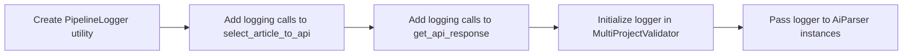

# Enhanced Pipeline Logging Specification

## 📋 Requirements Summary

**Objective**: Add detailed logging to track each URL's success/failure through two critical pipeline stages:
1. **Text Extraction Stage**: Web scraping via Playwright
2. **LLM Processing Stage**: API calls to language model

**Output Format**: CSV files in `pipeline_logs/` subdirectory with detailed error tracking

## 🏗️ Architecture Overview


## 📊 CSV Schema Design

**File Location**: `pipeline_logs/pipeline_log_2025-01-10_17-55-01.csv`

| Column | Type | Description | Example Values |
|--------|------|-------------|----------------|
| `URL` | string | The URL being processed | `https://example.com/article` |
| `project_name` | string | Project identifier | `SolarProject_CA` |
| `timestamp` | string | ISO 8601 with timezone | `2025-01-10T17:55:01-07:00` |
| `text_extraction_status` | string | Success/failure flag | `"True"` or `"False"` |
| `text_extraction_error` | string | Error details or None | `"None"` or `"TimeoutError: Page load timeout"` |
| `text_length` | integer | Characters extracted | `1542` or `0` |
| `llm_response_status` | string | Success/failure flag | `"True"` or `"False"` |
| `llm_response_error` | string | Error details or None | `"None"` or `"API rate limit exceeded"` |
| `response_time_ms` | integer | Total processing time | `2340` |

## 🔧 Implementation Strategy

### Option 1: Minimal Code Changes (Recommended)
Create a simple logging utility and integrate it directly into existing methods with minimal modifications.



### Key Integration Points:

1. **`main.py:86-88`**: Create `pipeline_logs/` directory
2. **`multi_project_validator.py:112-116`**: Initialize logger and pass to ModelValidator
3. **`page_tracker.py:select_article_to_api():98-131`**: Add logging for text extraction
4. **`page_tracker.py:get_api_response():65-83`**: Add logging for LLM responses

## 📝 Detailed Implementation Plan

### Phase 1: Create Logging Infrastructure
1. **Create `pipeline_logger.py`**
   - `PipelineLogger` class with CSV writing capabilities
   - Thread-safe file operations for concurrent URL processing
   - Automatic timestamp generation and file naming

### Phase 2: Integrate Logging Points
2. **Modify `page_tracker.py:select_article_to_api():98-131`**
   - Add timing measurements around Playwright operations
   - Capture text extraction success/failure
   - Log text length and any extraction errors

3. **Modify `page_tracker.py:get_api_response():65-83`**
   - Add timing measurements around API calls
   - Capture LLM response success/failure
   - Log API errors and response status

### Phase 3: Wire Up the Pipeline
4. **Modify `multi_project_validator.py:112-116`**
   - Initialize PipelineLogger with timestamped filename
   - Pass logger instance to ModelValidator and AiParser

5. **Modify `main.py:86-88`**
   - Create `pipeline_logs/` directory alongside existing directories

## 🔍 Error Handling Strategy


## 📈 Performance Considerations

- **Minimal Overhead**: CSV writing happens asynchronously to avoid blocking URL processing
- **Memory Efficient**: Write rows immediately rather than buffering entire dataset
- **Thread Safety**: Use file locking for concurrent access from multiple async tasks
- **Error Resilience**: Logging failures won't crash the main pipeline

## 🧪 Testing Strategy

1. **Unit Tests**: Test PipelineLogger CSV writing and error handling
2. **Integration Tests**: Verify logging works with actual URL processing
3. **Error Simulation**: Test logging behavior with network failures and API errors
4. **Performance Tests**: Ensure logging doesn't significantly impact processing speed

## 📋 File Structure Changes

```
aiparserpipeline/
├── main.py (modified)
├── multi_project_validator.py (modified)  
├── page_tracker.py (modified)
├── pipeline_logger.py (new)
├── pipeline_logs/ (new directory)
│   └── pipeline_log_2025-01-10_17-55-01.csv (generated)
├── results/
├── checkpoints/
└── test_prompts/
```

## 🎯 Success Criteria

- ✅ Every URL processed generates exactly one CSV row
- ✅ Both success and failure cases are captured with detailed error information
- ✅ Timestamps are accurate and timezone-aware
- ✅ File naming follows the specified convention
- ✅ No impact on existing pipeline functionality
- ✅ Minimal code changes to existing methods

## 🔧 Specific Code Changes Required

### 1. Create `pipeline_logger.py`
```python
class PipelineLogger:
    def __init__(self, log_directory: Path)
    def log_url_processing(self, url: str, project_name: str, ...)
    def _write_csv_row(self, data: dict)
    def _ensure_csv_headers(self)
```

### 2. Modify `main.py`
- Add `pipeline_logs/` directory creation at line 88
- Pass logger to MultiProjectValidator constructor

### 3. Modify `multi_project_validator.py`
- Accept logger in constructor
- Pass logger to ModelValidator instances at line 112-116

### 4. Modify `page_tracker.py`
- Add logger parameter to AiParser constructor
- Instrument `select_article_to_api()` method with timing and error capture
- Instrument `get_api_response()` method with timing and error capture
- Call logger.log_url_processing() with collected metrics

This approach provides comprehensive logging while requiring minimal changes to the existing codebase. The logging will capture all the detailed information requested (success flags, error messages, response times, text length) in a structured CSV format that's easy to analyze.